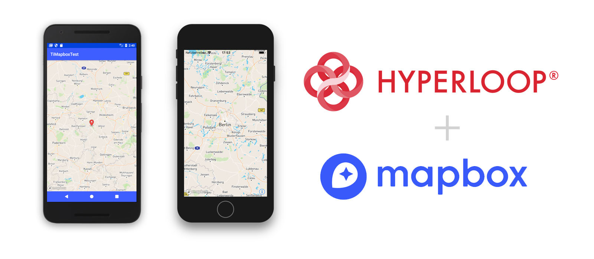

# Mapbox SDK in Titanium and Hyperloop

Use the Mapbox SDK (iOS and Android) in Axway Hyperloop! This is an example of using the SDK, so this does not 
expose all possible API's of the SDK. See the [official](https://www.mapbox.com/ios-sdk/) documentation for details.

> **Note**: The examples here are written in ES6 (enable with `<transpile>true</transpile>` in your tiapp.xml) and Titanium SDK 7.1.0. You can still use it with Titanium 7.0.x and classic ES5 if you want!



## Features

### View

```js
import MapBox from 'ti.mapbox';
const mapView = MapBox.createView({
  region: {
    latitude: 52.020388,
    longitude: 9.580078,
    animated: true
  }
});

myWindow.add(mapView.getInstance());
```

### Annotation

```js
const annotation = Mapbox.createAnnotation({
  latitude: 52.020388,
  longitude: 9.580078
});

mapView.addAnnotation(annotation.getInstance());
```

## iOS Configuration

Add the following tags to your plist-section of the tiapp.xml and change `YOUR_MAPBOX_ACCESS_TOKEN` to your
actual access token
```xml
<!-- Mapbox configuration -->
<key>MGLMapboxAccessToken</key>
<string>YOUR_MAPBOX_ACCESS_TOKEN</string>

<!-- General Geolocation permissions -->
<key>NSLocationWhenInUseUsageDescription</key>
<string>Can we access your location while using the app?</string>
<key>NSLocationAlwaysAndWhenInUseUsageDescription</key>
<string>Can we access your location?</string>
```

## Android Configuration
1. Place your access token in `Resources/android/ti.mapbox/index.js`
2. Ensure you have installed at least Gradle 4.1 by running `brew install gradle` and `brew update gradle`
3. Run gradle to pull down the necessary android libraries into `platform/android`:
```sh
gradle getDeps
```
4. Now build!
```sh
appc run -p android
```

## License

Apache 2.0

## Authors

- Hans Knöchel (Axway Appcelerator)
- Chris Williams (Axway Appcelerator)
